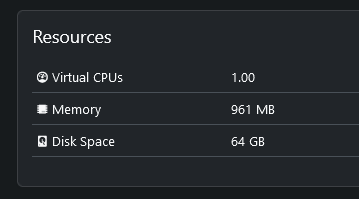

# Playbook: update_so_vm.yml

## Funcionamiento

Tan simple como lanzarlo:

```bash
$ ansible-playbook update_so_vm.yml
Hostname de la vm (pdns/zabbix/gitlab/mldonkey/etc...) [none]:
Hostname hypervisor (host1/host2) [none]:
```
## Verificaciones

Revisar en el NetBox que se han puesto bien:



